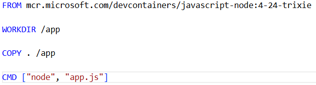

# NodeJS-WSL-DevContainers

References: 
https://code.visualstudio.com/docs/devcontainers/create-dev-container
https://code.visualstudio.com/docs/devcontainers/create-dev-container#_dockerfile
https://code.visualstudio.com/docs/nodejs/nodejs-tutorial 

## Pre-requisities

If WSL is not installed, download Ubuntu on WSL from here: 
https://ubuntu.com/desktop/wsl

Install Docker from here for your operating system:
https://docs.docker.com/desktop/

Follow the steps here to setup Docker Desktop's WSL2 support https://docs.docker.com/desktop/features/wsl/

Install Visual Studio Code: https://code.visualstudio.com/

Install the WSL and Dev Container extensions in Visual Studio Code:
https://marketplace.visualstudio.com/items?itemName=ms-vscode-remote.remote-wsl

https://marketplace.visualstudio.com/items?itemName=ms-vscode-remote.remote-containers

### Create a Dev Container

Hit F1 to open the command palette to find and select Dev Containers: Add Dev Container Configuration Files


Type node, from the options available select Node.js & JavaScript


For NodeJS version, choose 24-trixie (default)


When it asks to Select Features, for now we don't need to select anything, just select OK.


When it asks for optional files, for now we don't need to select anything, just select OK.


After the .devcontainer folder and the devcontainer.json file is added to the project, VSCode will ask to Reopen in Container. If the option doesn't show up, hit F1 and type in the following option Dev Containers: Open Folder in Container and select it.


### Create the Dockerfile

Create a file called "Dockerfile" and copy the line from the devcontainer.json file as the image to use as a base.



### Editting the devcontainer file

Since the Dockerfile now uses the image, replace the "image" line with this: "build": { "dockerfile": "Dockerfile" }

### Running Hello World

In VSCode's integrated terminal, type 
```node app.js```
to confirm that the app runs in the localized DevContainer environment in VSCode.