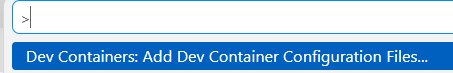
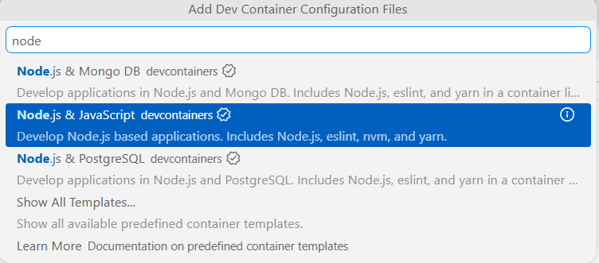
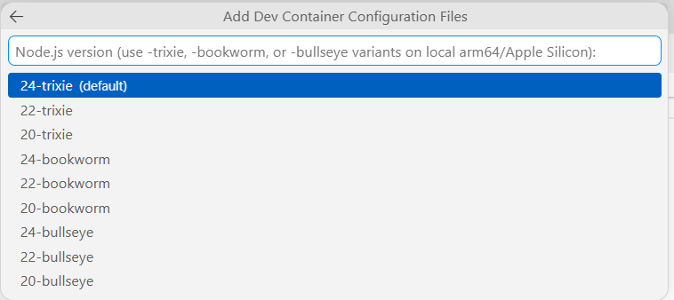
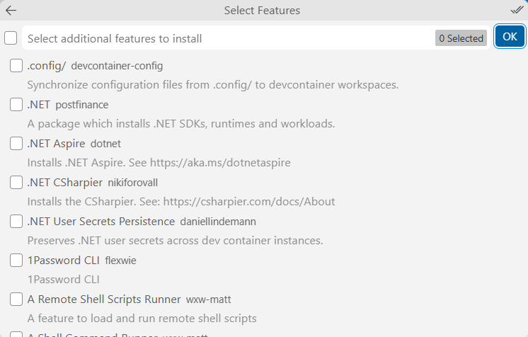
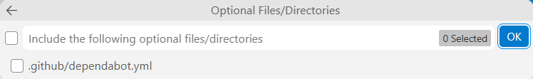
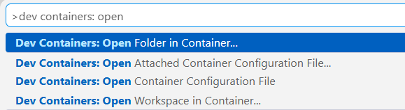

# NodeJS-WSL-DevContainers

References: 
https://medium.com/@ashkash.aishwarya/how-to-install-nodejs-in-wsl-6129afb2d3e3 
https://code.visualstudio.com/docs/devcontainers/create-dev-container
https://code.visualstudio.com/docs/nodejs/nodejs-tutorial 

## Pre-requisities

If WSL is not installed, download Ubuntu on WSL from here: 
https://ubuntu.com/desktop/wsl

Install Docker from here for your operating system:
https://docs.docker.com/desktop/

Follow the steps here to setup Docker Desktop's WSL2 support https://docs.docker.com/desktop/features/wsl/

Install Visual Studio Code: https://code.visualstudio.com/

Install the WSL and Dev Container extensions in Visual Studio Code:
https://marketplace.visualstudio.com/items?itemName=ms-vscode-remote.remote-wsl

https://marketplace.visualstudio.com/items?itemName=ms-vscode-remote.remote-containers

## Setup NodeJS app using Dev Containers in WSL

First make sure that curl is installed in WSL. This can be done by writing the following command in wsl

```curl — help```

### Install NVM

#### Install NVM using curl

```curl -o- https://raw.githubusercontent.com/nvm-sh/nvm/v0.34.0/install.sh | bash```

After the NVM installation process is complete you can verify its status by running the following command.

```command -v nvm```

Which will output the following if installation was successful.

```nvm```

### Installing NodeJS using NVM 

```nvm install node```

Verify node installation by running

```node --version```

### Create a Dev Container

Hit F1 to open the command palette to find and select Dev Containers: Add Dev Container Configuration Files



Type node, from the options available select Node.js & JavaScript



For NodeJS version, choose 24-trixie (default)



When it asks to Select Features, for now we don't need to select anything, just select OK.



When it asks for optional files, for now we don't need to select anything, just select OK.



After the .devcontainer folder and the devcontainer.json file is added to the project, VSCode will ask to Reopen in Container. If the option doesn't show up, hit F1 and type in the following option Dev Containers: Open Folder in Container and select it.



### Running Hello World

In the WSL terminal or in VSCode's integrated terminal, type 
```node app.js```
and it should print out Hello World.